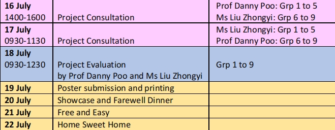

# Big-Data-Analytics-and-Visualization
You may approach this presentation in this manner:
1. Consider one level-1 business question that need answering from the data analysis. 
2. Add in any further sub-level questions for producing the appropriate insights for your story.
3. Conduct appropriate data cleaning.
4. Conduct exploratory analysis of the data with data visualisations featuring appropriate representation and 
presentation of data.
5. Use Tableau, MS Excel, or Python packages to produce your data visualisations.
6. Craft your presentation with the data visualisations and produce a coherent data storytelling
presentation with recommendations for your story.

1.考虑一个需要从数据分析中回答的一级业务问题。 
2.添加任何进一步的子级问题，为你的故事提供适当的见解。 
3.进行适当的数据清理。 
4.使用具有适当表示和表示的数据可视化对数据进行探索性分析。 
5.使用表格、MS Excel或Python软件包来生成您的数据可视化。 
6.用数据可视化制作你的演示，并为你的故事制作一个连贯的数据讲故事演示。

